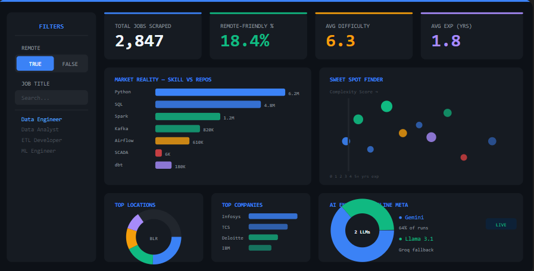

Markdown
# 🚀 AI-Powered Career Intelligence Data Pipeline



## 📌 Project Overview
The **Career Intelligence Data Pipeline** is an automated, enterprise-grade ELT (Extract, Load, Transform) system designed to analyze the entry-level tech job market. 

Traditional job boards are messy and unstructured. This project solves that by scraping raw job snippets, using an **Active-Active Multi-LLM architecture** to extract structured schema (skills, remote status, complexity, experience required), validating those skills against live GitHub repository data, and serving the cleaned data to a Power BI dashboard.

## 🏗️ Architecture Flow (Medallion Architecture)

1. **Bronze Layer (Raw Data):** 
   * Automated Python scripts fetch unstructured job search snippets via Google Search APIs.
   * Data is stored locally as raw JSON files.
2. **Silver Layer (AI Enrichment):** 
   * **Multi-LLM Extraction:** Parses raw snippets to extract structured fields (`Company`, `Location`, `Skills`, `Complexity_Score`, `Min_Experience`).
   * **Market Validation:** Queries the GitHub REST API to count total repositories for each extracted skill, proving real-world demand vs. employer asks.
3. **Gold Layer (Analytics Ready):** 
   * **Pandas Transformation:** Flattens nested JSON arrays.
   * **Data Quality Guardrails:** Catches and sanitizes AI hallucinations (e.g., converting accidental lists into strings).
   * **Deduplication:** Removes duplicate job postings before exporting the final `gold_standard_jobs.csv`.
4. **Presentation Layer:** 
   * **Power BI:** Connects to the Gold CSV to visualize market trends, skill demand, and the "Sweet Spot" (low experience, high complexity roles).

## 🛠️ Tech Stack & Tools
* **Language:** Python 3.10+
* **Data Processing:** Pandas, JSON
* **Primary AI Engine:** Google Gemini 2.5 Flash
* **Fallback AI Engine:** Groq (Llama-3.1-8b-instant)
* **External APIs:** GitHub REST API
* **Visualization:** Power BI Desktop

## ✨ Key Engineering Features

* **Active-Active LLM Load Balancer:** Google Gemini enforces strict rate limits (429/503 errors). The pipeline features a custom load balancer that catches these timeout errors and instantly routes traffic to an open-source Llama 3.1 model running on Groq to ensure zero downtime.
* **Automated API Key Rotation:** If the primary daily quota is exhausted, the system automatically iterates through a pool of backup Gemini API keys before triggering the Groq fallback.
* **API Throttling & Caching:** Implemented in-memory caching and base throttling (`time.sleep`) to respect GitHub and Google's strict rate limits and avoid IP bans.
* **AI Hallucination Handling:** LLMs occasionally ignore JSON schema constraints (e.g., returning a Python list instead of a string). The Pandas transformation layer includes custom sanitization functions to flatten arrays and prevent `unhashable type` crashes during deduplication.

## 📂 Project Structure
```text
career-intelligence-pipeline/
│
├── data/
│   ├── 1_bronze_raw/           # Raw JSON search results
│   ├── 2_silver_enriched/      # AI-extracted and GitHub-validated JSON
│   └── 3_gold_standard/        # Final deduplicated CSV for Power BI
│
├── src/
│   ├── utils/
│   │   └── helpers.py          # Logging and environment config
│   ├── intelligence/
│   │   └── ai_enricher.py      # LLM load balancer & GitHub API integration
│   └── transformation/
│       └── spark_processor.py  # Pandas flattening and data quality checks
│
├── .env.example                # Template for API keys
├── requirements.txt            # Python dependencies
└── README.md
🚀 How to Run Locally
1. Clone the repository

Bash
git clone [https://github.com/YourUsername/career-intelligence-pipeline.git](https://github.com/YourUsername/career-intelligence-pipeline.git)
cd career-intelligence-pipeline
2. Set up the Virtual Environment

Bash
python -m venv venv
source venv/bin/activate  # On Windows: venv\Scripts\activate
pip install -r requirements.txt
3. Configure Environment Variables
Create a .env file in the root directory and add your keys:

Plaintext
GEMINI_API_KEY=your_gemini_key_1,your_gemini_key_2
GROQ_API_KEY=your_groq_key
GITHUB_TOKEN=your_github_personal_access_token
4. Run the Pipeline

Bash
# Step 1: Run the AI Enrichment (Bronze -> Silver)
python -m src.intelligence.ai_enricher

# Step 2: Run the Pandas Transformation (Silver -> Gold)
python -m src.transformation.spark_processor
5. View the Dashboard
Open Power BI Desktop, load the gold_standard_jobs.csv from the data/3_gold_standard/ folder, and refresh the visuals!

🔮 Future Enhancements
Migrate the Pandas transformation script to PySpark for handling larger, state-wide datasets.

Transition from local JSON storage to an AWS S3 bucket data lake.

Automate the pipeline to run daily using Apache Airflow or GitHub Actions.